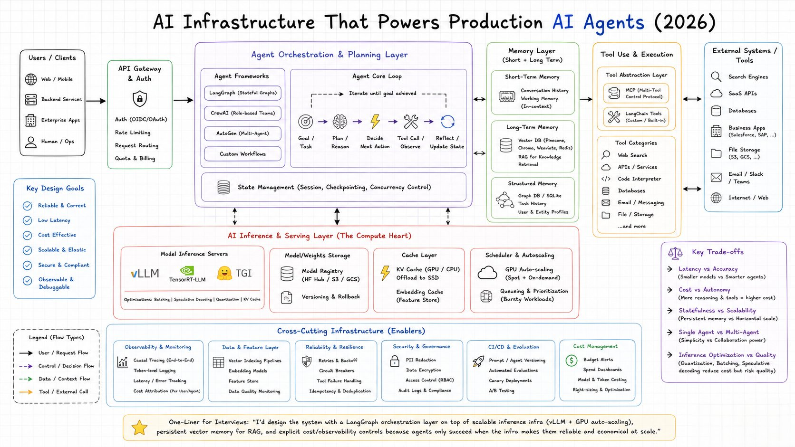

# AI Platform Architecture — Production-Grade Agentic AI Infrastructure

> Source note: this document is a faithful, comprehensive transcription and
> elaboration of the reference diagram `AI-arch.jpeg` ("AI Infrastructure
> That Powers Production AI Agents (2026)") in this same folder. Every
> building block, connector, and callout below traces back to that image —
> nothing is invented or added beyond it. Known gaps between this reference
> architecture and a fully production-hardened deployment for our
> Observability, ITSM, and Security use cases are tracked separately (see
> the companion gap-analysis discussion, not embedded here, so this document
> stays a clean 1:1 reference of the source diagram).

## Purpose & Scope

This is the foundational architecture reference for the **AI Engine** project
track (see `docs/superpowers/specs/2026-08-15-platform-customer-app-split-notes.md`,
§6) — the agentic reasoning core that Platform App runs on. It defines the
building blocks a production-grade agentic AI system needs to power three
converging use cases in this program:

- **Observability** — agents that reason over traces/metrics/logs to explain
  system behavior.
- **ITSM** — agents that investigate and resolve incidents (the "Incident"
  tab described in the platform/customer-app split notes), turning every
  investigated case into reusable memory.
- **Security** — agents that operate under the same governance, audit, and
  access-control bar as any other production actor touching sensitive data.

This document describes the reference architecture only. It is the first
step of an iterative, step-by-step build — no implementation decisions are
made here beyond what the source diagram specifies.

## Source Diagram



## Design Goals

The reference architecture is organized around six non-negotiable goals.
Every layer below exists in service of one or more of these:

| Goal | What it means in practice |
|---|---|
| **Reliable & Correct** | Agents produce correct, trustworthy outputs consistently, not just on the happy path. |
| **Low Latency** | End-to-end response time (gateway → orchestration → inference → tools → response) stays within user-facing SLAs. |
| **Cost Effective** | Token spend, GPU spend, and tool-call spend are bounded and predictable per user/agent/tenant. |
| **Scalable & Elastic** | The system absorbs bursty, unpredictable agentic workloads without manual intervention. |
| **Secure & Compliant** | Every layer enforces access control, data protection, and auditability equivalent to any other production system. |
| **Observable & Debuggable** | Every agent decision, tool call, and token is traceable end-to-end for debugging and accountability. |

## Architecture at a Glance

The platform is organized into four request-path layers, flanked by client-facing
and external-facing edges, sitting on top of a compute layer, all underpinned
by a horizontal cross-cutting infrastructure layer:

```
Users/Clients → API Gateway & Auth → Agent Orchestration & Planning Layer
                                            ↕                    ↕
                                     Memory Layer  ↔  Tool Use & Execution → External Systems/Tools
                                            ↕                    ↕
                              AI Inference & Serving Layer (The Compute Heart)
                                            ↕
                        Cross-Cutting Infrastructure (Enablers) — spans everything above
```

**End-to-end request lifecycle:**

1. A request originates from **Users/Clients** (web/mobile, backend
   services, enterprise apps, or a human operator).
2. It is authenticated, rate-limited, routed, and metered by the **API
   Gateway & Auth** layer.
3. It enters the **Agent Orchestration & Planning Layer**, where an agent
   framework runs the **Agent Core Loop** — iterating Goal → Plan/Reason →
   Decide Next Action → Tool Call/Observe → Reflect/Update State until the
   goal is achieved — backed by explicit **State Management**.
4. On every iteration, the orchestration layer reads and writes the **Memory
   Layer** (short-term, long-term, structured) to ground its reasoning in
   context, and — when a plan step requires external action — invokes the
   **Tool Use & Execution** layer, which reaches out to **External
   Systems/Tools**.
5. Every reasoning step, memory embedding/retrieval, and tool-selection
   decision is ultimately backed by a call into the **AI Inference & Serving
   Layer** — the compute heart that actually runs the model.
6. All of the above is wrapped by **Cross-Cutting Infrastructure** —
   observability, data/feature pipelines, reliability, security/governance,
   CI/CD & evaluation, and cost management — which instruments and protects
   every other layer rather than sitting in the request path itself.

---

## 1. Users / Clients

The entry points that originate agentic requests:

| Client type | Description |
|---|---|
| Web / Mobile | End-user-facing applications |
| Backend Services | Service-to-service agentic calls from other internal systems |
| Enterprise Apps | Line-of-business applications embedding agent capability |
| Human / Ops | Direct human/operator interaction (e.g. SRE driving an investigation) |

## 2. API Gateway & Auth

The single controlled entry point in front of the agent platform. Responsibilities:

- **Auth (OIDC/OAuth)** — identity verification for every caller, human or
  service.
- **Rate Limiting** — protects downstream compute from overload.
- **Request Routing** — directs traffic to the correct orchestration
  endpoint/agent.
- **Quota & Billing** — enforces per-user/per-tenant usage limits and feeds
  cost attribution.

## 3. Agent Orchestration & Planning Layer

The control plane of the system — where goals become plans and plans become
actions.

### 3.1 Agent Frameworks

The orchestration layer supports multiple agent-building paradigms, selected
per use case:

| Framework | Paradigm |
|---|---|
| **LangGraph** | Stateful Graphs — explicit state machines for agent flow |
| **CrewAI** | Role-based Teams — multiple agents with defined roles collaborating |
| **AutoGen** | Multi-Agent — conversational multi-agent orchestration |
| **Custom Workflows** | Purpose-built orchestration where a framework doesn't fit |

### 3.2 Agent Core Loop

Every agent execution — regardless of framework — follows the same
iterative loop, repeated **until the goal is achieved**:

```
Goal/Task → Plan/Reason → Decide Next Action → Tool Call/Observe → Reflect/Update State
     ↑___________________________________________________________________|
```

- **Goal / Task** — the objective the agent is pursuing.
- **Plan / Reason** — the agent reasons about how to achieve the goal.
- **Decide Next Action** — the agent selects the next concrete step.
- **Tool Call / Observe** — the agent executes a tool call and observes the
  result (see Tool Use & Execution, §5).
- **Reflect / Update State** — the agent evaluates progress and updates its
  internal state before the next iteration.

### 3.3 State Management

A dedicated capability spanning the whole orchestration layer:

- **Session** state across a multi-turn interaction
- **Checkpointing** so long-running agent runs can resume after failure
- **Concurrency Control** for parallel agent/tool execution

---

## 4. Memory Layer (Short + Long Term)

The layer that gives agents context and continuity beyond a single inference
call.

### 4.1 Short-Term Memory
- **Conversation History** — the running dialogue/interaction log.
- **Working Memory (In-context)** — what's held in the active context
  window for the current reasoning step.

### 4.2 Long-Term Memory
- **Vector DB** (Pinecone, Chroma, Weaviate, Redis) — semantic storage for
  retrieval.
- **RAG for Knowledge Retrieval** — retrieval-augmented generation grounding
  agent responses in stored knowledge.

### 4.3 Structured Memory
- **Graph DB / SQLite** — relationship-aware or lightweight structured
  storage.
- **Task History** — record of prior tasks/executions.
- **User & Entity Profiles** — structured facts about users/entities the
  agent interacts with.

---

## 5. Tool Use & Execution

The layer that lets an agent act on the world beyond text generation.

### 5.1 Tool Abstraction Layer

- **MCP (Multi-Tool Control Protocol)** — a standardized protocol for
  exposing tools to agents.¹
- **LangChain Tools (Custom / Built-in)** — framework-native tool
  definitions, both off-the-shelf and custom-built.

¹ *Fidelity note:* the source diagram labels this "Multi-Tool Control
Protocol." The same acronym is more widely known in the industry as **Model
Context Protocol**. The diagram's exact phrasing is preserved here for
fidelity to the source; this discrepancy should be confirmed/corrected in
the next design pass.

### 5.2 Tool Categories

| Category | Examples |
|---|---|
| Web Search | — |
| APIs / Services | — |
| Code Interpreter | — |
| Databases | — |
| Email / Messaging | — |
| File / Storage | — |
| ...and more | Diagram indicates this list is illustrative, not exhaustive |

---

## 6. External Systems / Tools

The concrete external endpoints that Tool Use & Execution ultimately calls
into:

| System | Examples |
|---|---|
| Search Engines | — |
| SaaS APIs | — |
| Databases | — |
| Business Apps | Salesforce, SAP, ... |
| File Storage | S3, GCS, ... |
| Email / Slack / Teams | — |
| Internet / Web | — |

---

## 7. AI Inference & Serving Layer (The Compute Heart)

The layer that actually runs model inference — the diagram calls this out
explicitly as "the compute heart" of the whole system, sitting beneath and
serving all three layers above it (orchestration, memory, tool use).

### 7.1 Model Inference Servers
- **vLLM**, **TensorRT-LLM**, **TGI** — production LLM serving engines.
- **Optimizations:** Batching | Speculative Decoding | Quantization | KV
  Cache — applied at the serving layer to control latency and cost.

### 7.2 Model / Weights Storage
- **Model Registry** (HF Hub / S3 / GCS) — canonical store of model
  artifacts.
- **Versioning & Rollback** — safe promotion/rollback of model versions.

### 7.3 Cache Layer
- **KV Cache (GPU / CPU)** with **Offload to SSD** — extends effective cache
  capacity beyond GPU memory.
- **Embedding Cache (Feature Store)** — avoids recomputing embeddings for
  previously seen inputs.

### 7.4 Scheduler & Autoscaling
- **GPU Auto-scaling** (Spot + On-demand) — elastic compute matched to
  demand, cost-optimized via spot capacity.
- **Queueing & Prioritization** (Bursty Workloads) — absorbs traffic spikes
  without dropping requests.

---

## 8. Cross-Cutting Infrastructure (Enablers)

Six categories of non-functional capability that wrap every layer above,
rather than sitting inline in any single request path.

### 8.1 Observability & Monitoring
- Causal Tracing (End-to-End)
- Token-level Logging
- Latency / Error Tracking
- Cost Attribution (Per User/Agent)

### 8.2 Data & Feature Layer
- Vector Indexing Pipelines
- Embedding Models
- Feature Store
- Data Quality Monitoring

### 8.3 Reliability & Resilience
- Retries & Backoff
- Circuit Breakers
- Tool Failure Handling
- Idempotency & Deduplication

### 8.4 Security & Governance
- PII Redaction
- Data Encryption
- Access Control (RBAC)
- Audit Logs & Compliance

### 8.5 CI/CD & Evaluation
- Prompt / Agent Versioning
- Automated Evaluations
- Canary Deployments
- A/B Testing

### 8.6 Cost Management
- Budget Alerts
- Spend Dashboards
- Model & Token Costing
- Right-sizing & Optimization

---

## Data, Control & Tool Flow

The diagram's legend defines four distinct flow types connecting the layers
above. These are semantically distinct and should stay distinct in any
implementation (e.g. as separate trace span kinds or event types):

| Flow type | Rendering | Where it appears |
|---|---|---|
| **User / Request Flow** | solid black arrow | Users/Clients → API Gateway & Auth → Agent Orchestration & Planning Layer |
| **Control / Decision Flow** | dashed purple arrow | Agent Orchestration & Planning Layer ↕ AI Inference & Serving Layer — planning decisions driving inference calls |
| **Data / Context Flow** | dashed green arrow | Agent Orchestration Layer ↔ Memory Layer ↔ AI Inference & Serving Layer — context/embeddings moving between orchestration, memory, and inference |
| **Tool / External Call** | orange arrow | Tool Use & Execution ↔ External Systems/Tools, and Memory Layer ↔ Tool Use & Execution |

Layer-to-layer connectivity shown in the diagram:

- **Agent Orchestration & Planning Layer ↔ Memory Layer** — bidirectional:
  orchestration reads context to reason, writes updates back after each
  loop iteration.
- **Memory Layer ↔ Tool Use & Execution** — bidirectional: tool results can
  update memory; memory can inform tool selection.
- **Tool Use & Execution ↔ External Systems/Tools** — bidirectional tool
  invocation and response.
- **Agent Orchestration, Memory, and Tool Use layers ↕ AI Inference &
  Serving Layer** — all three top layers depend on the inference layer for
  every model call (reasoning, embedding generation, tool-argument
  generation).
- **Cross-Cutting Infrastructure** — spans horizontally beneath every layer
  above it (not a request-path connection; an enabling/observing
  relationship over all of them).

---

## Key Trade-offs

The reference architecture explicitly calls out five trade-offs that every
implementation decision in this system must be weighed against:

1. **Latency vs Accuracy** — smaller models vs. smarter agents.
2. **Cost vs Autonomy** — more reasoning and more tool calls means higher
   cost.
3. **Statefulness vs Scalability** — persistent memory vs. horizontal scale.
4. **Single Agent vs Multi-Agent** — simplicity vs. collaboration power.
5. **Inference Optimization vs Quality** — quantization, batching, and
   speculative decoding reduce cost but risk quality.

---

## Design Philosophy

The source diagram closes with a one-line summary of the design philosophy
this whole architecture embodies, reproduced verbatim:

> "I'd design the system with a LangGraph orchestration layer on top of
> scalable inference infra (vLLM + GPU auto-scaling), persistent vector
> memory for RAG, and explicit cost/observability controls because agents
> only succeed when the infra makes them reliable and economical at scale."

---

## Appendix: Full Building Block Inventory

| Layer | Sub-component | Building blocks |
|---|---|---|
| Users / Clients | — | Web/Mobile, Backend Services, Enterprise Apps, Human/Ops |
| API Gateway & Auth | — | Auth (OIDC/OAuth), Rate Limiting, Request Routing, Quota & Billing |
| Agent Orchestration & Planning | Agent Frameworks | LangGraph, CrewAI, AutoGen, Custom Workflows |
| Agent Orchestration & Planning | Agent Core Loop | Goal/Task, Plan/Reason, Decide Next Action, Tool Call/Observe, Reflect/Update State |
| Agent Orchestration & Planning | State Management | Session, Checkpointing, Concurrency Control |
| Memory Layer | Short-Term | Conversation History, Working Memory (In-context) |
| Memory Layer | Long-Term | Vector DB (Pinecone/Chroma/Weaviate/Redis), RAG for Knowledge Retrieval |
| Memory Layer | Structured | Graph DB/SQLite, Task History, User & Entity Profiles |
| Tool Use & Execution | Tool Abstraction | MCP (Multi-Tool Control Protocol), LangChain Tools |
| Tool Use & Execution | Tool Categories | Web Search, APIs/Services, Code Interpreter, Databases, Email/Messaging, File/Storage |
| External Systems / Tools | — | Search Engines, SaaS APIs, Databases, Business Apps, File Storage, Email/Slack/Teams, Internet/Web |
| AI Inference & Serving | Model Inference Servers | vLLM, TensorRT-LLM, TGI (+ Batching, Speculative Decoding, Quantization, KV Cache) |
| AI Inference & Serving | Model/Weights Storage | Model Registry (HF Hub/S3/GCS), Versioning & Rollback |
| AI Inference & Serving | Cache Layer | KV Cache (GPU/CPU) + SSD Offload, Embedding Cache (Feature Store) |
| AI Inference & Serving | Scheduler & Autoscaling | GPU Auto-scaling (Spot + On-demand), Queueing & Prioritization |
| Cross-Cutting | Observability & Monitoring | Causal Tracing, Token-level Logging, Latency/Error Tracking, Cost Attribution |
| Cross-Cutting | Data & Feature Layer | Vector Indexing Pipelines, Embedding Models, Feature Store, Data Quality Monitoring |
| Cross-Cutting | Reliability & Resilience | Retries & Backoff, Circuit Breakers, Tool Failure Handling, Idempotency & Deduplication |
| Cross-Cutting | Security & Governance | PII Redaction, Data Encryption, Access Control (RBAC), Audit Logs & Compliance |
| Cross-Cutting | CI/CD & Evaluation | Prompt/Agent Versioning, Automated Evaluations, Canary Deployments, A/B Testing |
| Cross-Cutting | Cost Management | Budget Alerts, Spend Dashboards, Model & Token Costing, Right-sizing & Optimization |
