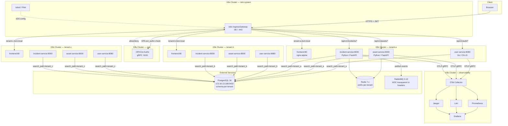

# System Overview

**Synap** is an AI-native, multi-tenant IT Service Management (ITSM) + IT Operations Management (ITOM) platform built as a cloud-native open-source reference implementation. It runs on a kubeadm Kubernetes cluster with Istio service mesh, OPA policy enforcement, and full OpenTelemetry observability.

---

## Deployment Model

### Target Architecture (Phase 6+)

Each tenant runs in its own dedicated Kubernetes namespace. Traffic enters through a shared Istio IngressGateway and is routed to the correct namespace by subdomain.

```
tenant-a.itsm.local  → namespace: tenant-a
tenant-b.itsm.local  → namespace: tenant-b
tenant-c.itsm.local  → namespace: tenant-c
```

### Current State (Phase 5 — single namespace stepping stone)

All services currently run in `itsm-dev`. Phase 6 migrates to the target per-namespace model.

---

## System Architecture Diagram



---

## Request Flow Walk-Through

A typical authenticated API call (e.g., listing incidents for tenant-a) travels through these layers:

```
1. Browser → HTTPS request to tenant-a.itsm.local
             Authorization: Bearer <JWT>

2. Istio IngressGateway
   └─ RequestAuthentication: validates RS256 JWT signature against
      JWKS endpoint on user-service (/api/v1/.well-known/jwks.json)
   └─ AuthorizationPolicy (DENY): rejects request if JWT is invalid
      or tenant_id claim does not match tenant-a namespace
   └─ ext_authz (CUSTOM): calls OPA at gRPC :9191 with
      { role, method, path } → OPA allows/denies based on Rego policy

3. Istio injects headers into the upstream request:
   X-Tenant-ID: tenant_a          (from JWT claim tenant_id)
   X-User-Role: agent             (from JWT claim role)

4. incident-service receives the request
   └─ Reads X-Tenant-ID and X-User-Role headers
   └─ Sets PostgreSQL search_path = tenant_a for this connection
   └─ Executes query (data stays within tenant_a schema)
   └─ Checks Redis cache: itsm:tenant_a:incidents:list:<hash>
   └─ Emits OTel span: itsm.incident.list
      with attributes: tenant.id=tenant_a, user.role=agent

5. Response returns through Istio sidecar (mTLS within cluster)
```

---

## Component Responsibility Matrix

| Component | Namespace | Port | Language | Role |
|---|---|---|---|---|
| **Istio IngressGateway** | istio-system | 80/443 | — | TLS termination, JWT validation, subdomain routing, rate limiting |
| **Istiod** | istio-system | 15010/15012 | — | Control plane; xDS config push to all sidecars |
| **OPA** | opa | 9191 (gRPC) | — | RBAC Rego policy; ext_authz for Istio |
| **frontend** | tenant-{x} | 80 | TypeScript (nginx) | Synap UI; SPA served by nginx:alpine |
| **user-service** | tenant-{x} | 8080 | Go / Chi v5 | AuthN: login, token issue, JWKS; user CRUD |
| **asset-service** | tenant-{x} | 8000 | Python / FastAPI | Asset CRUD, Redis cache |
| **incident-service** | tenant-{x} | 8000 | Python / FastAPI | Incident lifecycle, RabbitMQ events |
| **notification-service** | tenant-{x} | 8080 | Go / Chi v5 | RabbitMQ consumer; notifications (Phase 8) |
| **ai-service** | tenant-{x} | 8000 | Python / FastAPI | AIOps triage, semantic search (Phase 7) |
| **OTel Collector** | observability | 4317 (gRPC) | — | Receives OTLP from all services; fans out |
| **Prometheus** | observability | 9090 | — | Metrics scraping + storage |
| **Loki** | observability | 3100 | — | Log aggregation |
| **Jaeger** | observability | 16686 | — | Distributed tracing UI |
| **Grafana** | observability | 3000 | — | Unified dashboard |
| **ArgoCD** | argocd | 8080 | — | GitOps: syncs Helm releases from git (Phase 9) |
| **PostgreSQL 16** | external | 5432 | — | Schema-per-tenant; runs outside K8s |
| **Redis 7.x** | in-cluster | 6379 | — | Shared cache; prefix-per-tenant key isolation |
| **RabbitMQ 3.13** | in-cluster | 5672 | — | Async event bus; W3C traceparent in AMQP headers |

---

## Infrastructure Constraints

| Resource | Value |
|---|---|
| Cluster nodes | 3 (1 control-plane + 2 workers) |
| Total RAM | 16 GB |
| Usable workload RAM | ~10–11 GB |
| HPA per service | min=1, max=2 replicas |
| HPA CPU threshold | 70% |

---

## Environment Model

All resources accept `ENV=dev` (default) or `ENV=qa`. Switching environments changes only this one variable — no YAML edits required.

| ENV | Namespaces | External DB |
|---|---|---|
| dev | tenant-a, tenant-b, tenant-c | 172.16.13.168:5432/itsm |
| qa | tenant-a-qa, tenant-b-qa, tenant-c-qa | 172.16.13.168:5432/itsm_qa |

---

## Phase Delivery Map

| Phase | Deliverable | Status |
|---|---|---|
| 1 | Repo scaffold, go.mod, pyproject.toml | ✅ Complete |
| 2 | PostgreSQL schema + migrations (schema-per-tenant) | ✅ Complete |
| 3 | User Service — login, JWT issue, JWKS endpoint | ✅ Complete |
| 4 | Asset Service + Incident Service | ✅ Complete |
| 5 | Helm charts + Dockerfiles + K8s manifests (itsm-dev) | ✅ Complete |
| 6 | Istio + OPA; per-namespace tenant model; RS256 JWT | 🔲 In Progress |
| 7 | AI Service — triage, semantic search, pgvector | 🔲 Pending |
| 8 | Full OTel observability — metrics, logs, traces | 🔲 Pending |
| 9 | CI/CD + ArgoCD GitOps | 🔲 Pending |
