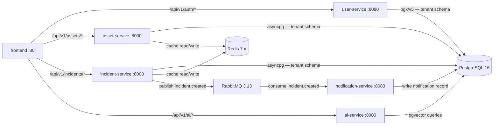
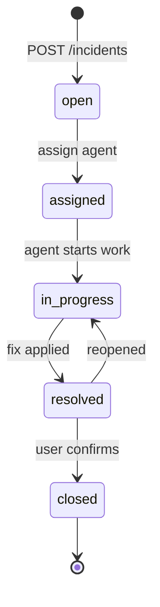

# Service Design

This document describes every application service in Synap: its responsibilities, API surface, technology stack, and integration points.

---

## Service Inventory

| Service | Language | Framework | Port | Image |
|---|---|---|---|---|
| user-service | Go 1.22+ | Chi v5 | **8080** | preet2fun/user-service |
| asset-service | Python 3.12+ | FastAPI 0.111+ | **8000** | preet2fun/asset-service |
| incident-service | Python 3.12+ | FastAPI 0.111+ | **8000** | preet2fun/incident-service |
| notification-service | Go 1.22+ | Chi v5 | **8080** | preet2fun/notification-service |
| ai-service | Python 3.12+ | FastAPI 0.111+ | **8000** | preet2fun/ai-service |
| frontend | TypeScript + Vite | React 18 + nginx | **80** | preet2fun/frontend |

---

## Service Interaction Diagram



---

## user-service

**Language:** Go 1.22+  
**Framework:** Chi v5  
**Port:** 8080  
**Key libraries:** `pgx/v5`, `golang-jwt/jwt v5`, `otelchi`

### Responsibilities
- Issue RS256 JWT on successful login (Phase 6+; HS256 in Phase 3–5)
- Expose JWKS endpoint for Istio `RequestAuthentication`
- User CRUD (create, list, get, update) scoped to tenant schema
- Email OTP MFA flow (v0.4.0 — Sprint 1 backend)
- Token refresh

### API Endpoints

| Method | Path | Auth | Description |
|---|---|---|---|
| POST | /api/v1/auth/login | None | Email + password; returns JWT |
| POST | /api/v1/auth/refresh | JWT | Refresh access token |
| POST | /api/v1/auth/otp/send | JWT (partial) | Send email OTP for MFA step |
| POST | /api/v1/auth/otp/verify | JWT (partial) | Verify OTP; returns full JWT |
| GET | /api/v1/.well-known/jwks.json | None | JWKS — Istio fetches on startup |
| GET | /api/v1/users | JWT | List users (admin/agent) |
| POST | /api/v1/users | JWT (admin) | Create user |
| GET | /api/v1/users/{id} | JWT | Get user by ID |
| PUT | /api/v1/users/{id} | JWT (admin) | Update user |
| GET | /health | None | Liveness/readiness probe |

### JWT Claims
```json
{
  "sub":       "u1000001",
  "tenant_id": "tenant_a",
  "role":      "agent",
  "email":     "alice@globaltech.example",
  "iss":       "itsm-user-service",
  "exp":       1750000000,
  "iat":       1749996400,
  "jti":       "uuid-v4"
}
```

### Integration Notes
- Sets PostgreSQL `search_path = <tenant_slug>` per connection using `X-Tenant-ID` header
- Never validates incoming JWT (services receive pre-validated claims via headers)
- OTel span name: `itsm.user.login`, `itsm.user.create`, etc.

---

## asset-service

**Language:** Python 3.12+  
**Framework:** FastAPI 0.111+  
**Port:** 8000  
**Key libraries:** `SQLAlchemy 2.x async`, `asyncpg`, `opentelemetry-sdk`

### Responsibilities
- Asset CRUD: create, list, get, update, delete
- Asset type filtering and full-text search (`pg_trgm`)
- Redis cache for list and get operations
- OTel instrumentation on all handlers

### API Endpoints

| Method | Path | Auth | Description |
|---|---|---|---|
| GET | /api/v1/assets | JWT | List assets (paginated, filterable) |
| POST | /api/v1/assets | JWT (admin/agent) | Create asset |
| GET | /api/v1/assets/{id} | JWT | Get asset by ID |
| PUT | /api/v1/assets/{id} | JWT (admin/agent) | Update asset |
| DELETE | /api/v1/assets/{id} | JWT (admin) | Delete asset |
| GET | /health | None | Liveness/readiness probe |

### Cache Strategy
- Cache key: `itsm:{tenant_slug}:assets:list:{hash_of_query_params}`
- Cache key: `itsm:{tenant_slug}:assets:{asset_id}`
- TTL: 300 seconds
- Invalidated on create/update/delete

### Integration Notes
- Reads `X-Tenant-ID` and `X-User-Role` from Istio-injected headers
- Sets `search_path` per async DB session
- OTel span names: `itsm.asset.list`, `itsm.asset.create`, `itsm.asset.search`

---

## incident-service

**Language:** Python 3.12+  
**Framework:** FastAPI 0.111+  
**Port:** 8000  
**Key libraries:** `SQLAlchemy 2.x async`, `asyncpg`, `aio-pika`, `opentelemetry-sdk`

### Responsibilities
- Incident lifecycle: create → assign → in-progress → resolved → closed
- Incident event audit trail (append-only `incident_events` table)
- Priority management: P1 (Critical), P2 (High), P3 (Medium), P4 (Low)
- Publish `incident.created` and `incident.status_changed` events to RabbitMQ
- Redis cache for list and get operations
- W3C TraceContext propagation in AMQP message headers

### API Endpoints

| Method | Path | Auth | Description |
|---|---|---|---|
| GET | /api/v1/incidents | JWT | List incidents (paginated, filterable) |
| POST | /api/v1/incidents | JWT (admin/agent) | Create incident |
| GET | /api/v1/incidents/{id} | JWT | Get incident + events |
| PUT | /api/v1/incidents/{id} | JWT (admin/agent) | Update incident / transition status |
| DELETE | /api/v1/incidents/{id} | JWT (admin) | Delete incident |
| GET | /api/v1/incidents/{id}/events | JWT | Get audit event trail |
| GET | /health | None | Liveness/readiness probe |

### Incident Status Flow



### RabbitMQ Events
- Exchange: `itsm.incidents` (topic)
- Routing keys: `incident.created`, `incident.status_changed`, `incident.resolved`
- Message headers include `traceparent` for W3C TraceContext propagation

---

## notification-service

**Language:** Go 1.22+  
**Framework:** Chi v5  
**Port:** 8080  
**Key libraries:** `pgx/v5`, `amqp091-go`  
**Status:** Planned — full implementation in Phase 8

### Responsibilities
- Consume RabbitMQ events from all services
- Write notification records to PostgreSQL
- Serve notification list/read endpoints to the frontend

---

## ai-service

**Language:** Python 3.12+  
**Framework:** FastAPI 0.111+  
**Port:** 8000  
**Key libraries:** `pgvector`, LLM provider TBD  
**Status:** Planned — full implementation in Phase 7

### Responsibilities
- Incident triage: suggest priority + assignee from historical patterns
- Semantic search over knowledge base using pgvector embeddings
- Surface similar past incidents on incident create
- Power the Synap Copilot (Sprint 10)

---

## frontend (Synap UI)

**Language:** TypeScript  
**Framework:** Vite + React 18  
**Port:** 80 (served by nginx:alpine in K8s)  
**Key libraries:** React Router, TanStack Query (Sprint 11+), Zustand

### Responsibilities
- Pixel-matched implementation of the `design_handoff_synap/reference/` prototype
- OKLCH design token system + CSS Modules
- SPA routing via React Router
- Sprints 0–10: typed mock data from `reference/data.jsx` port
- Sprint 11: replace mock layer with TanStack Query + real backend API calls

### K8s Deployment
- Dockerfile: multi-stage `node:20-alpine` build → `nginx:alpine` serve
- nginx.conf: `try_files $uri $uri/ /index.html` for SPA routing
- Istio IngressGateway routes `/api/v1/*` to backend services — no proxy_pass in nginx
- Resources: 64Mi request / 128Mi limit

### Sprint Status

| Sprint | Screen | Status |
|---|---|---|
| Sprint 0 | Foundation — scaffold + tokens + primitives | ✅ Complete |
| Sprint 1 | Login — email/password + MFA (email OTP) | 🔲 Pending Phase 6 |
| Sprint 2 | App Shell — sidebar + topbar + routing + theme | 🔲 Not Started |
| Sprint 3 | Asset Module | 🔲 Not Started |
| Sprint 4 | Incident Module | 🔲 Not Started |
| Sprint 5–10 | Dashboard, AIOps, Portal, CMDB, Admin, Copilot | 🔲 Not Started |
| Sprint 11 | Real API wiring | 🔲 Not Started |

---

## Resource Limits Reference

| Service | CPU Request | CPU Limit | Mem Request | Mem Limit |
|---|---|---|---|---|
| user-service | 100m | 300m | 128Mi | 256Mi |
| asset-service | 100m | 300m | 128Mi | 256Mi |
| incident-service | 100m | 300m | 128Mi | 256Mi |
| notification-service | 50m | 200m | 64Mi | 128Mi |
| ai-service | 100m | 400m | 256Mi | 512Mi |
| frontend | 50m | 200m | 64Mi | 128Mi |
