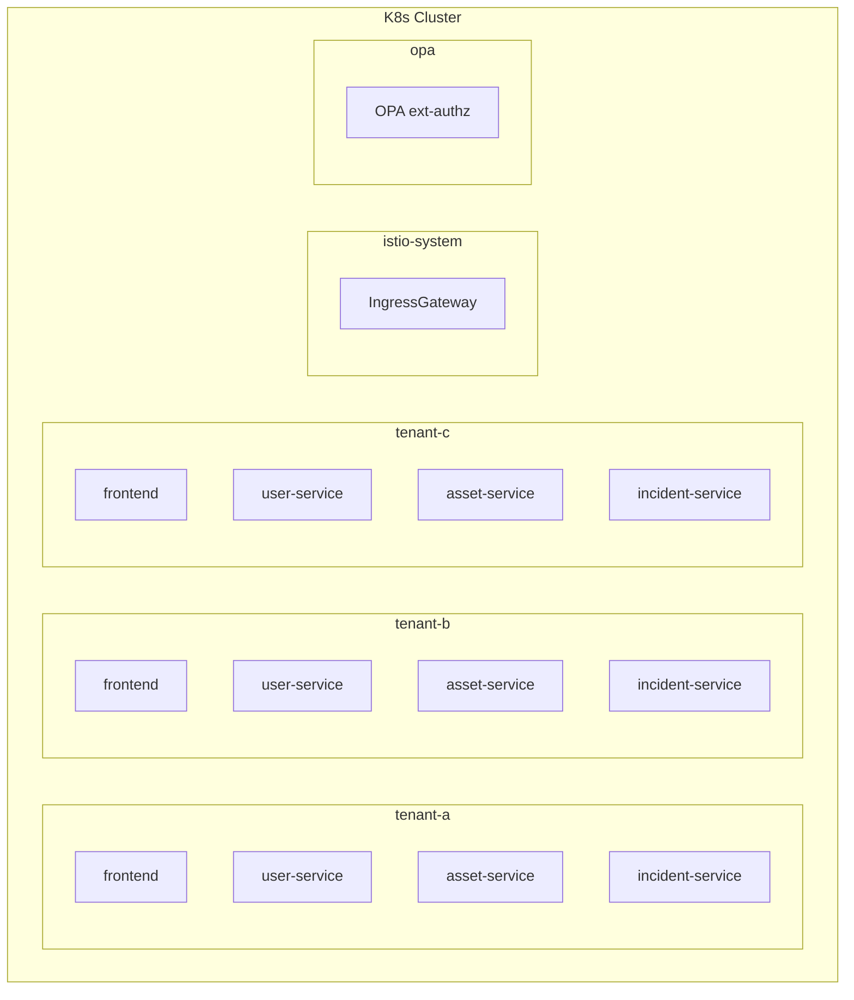
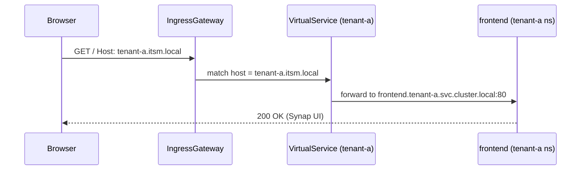
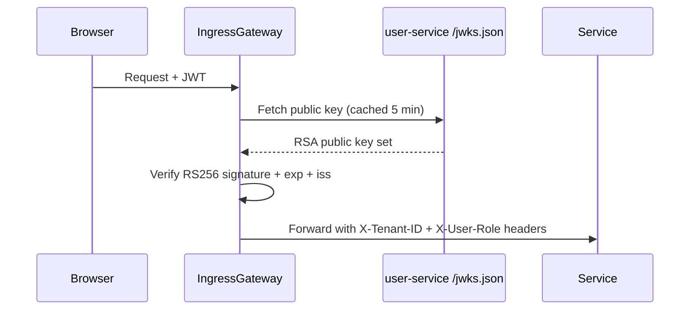
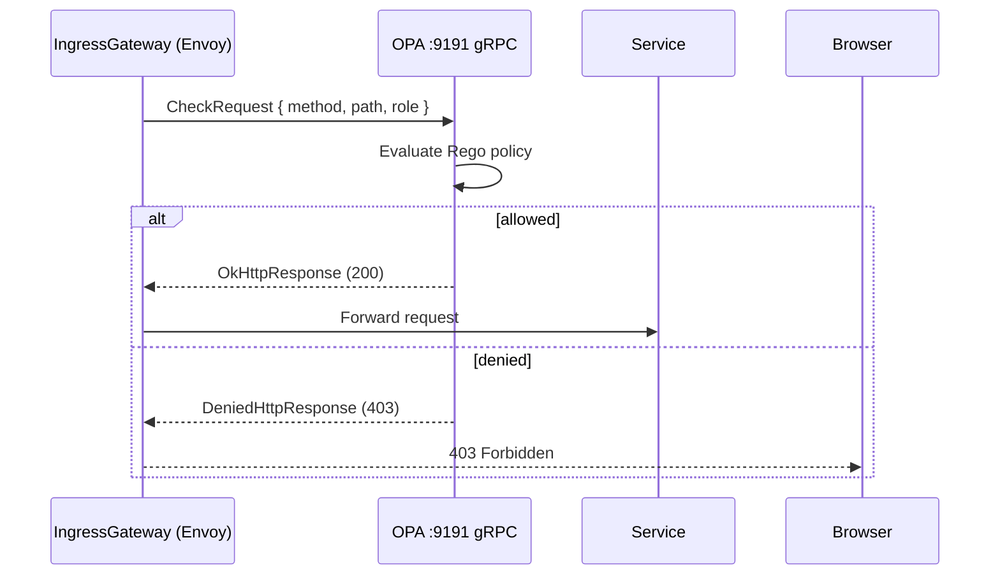
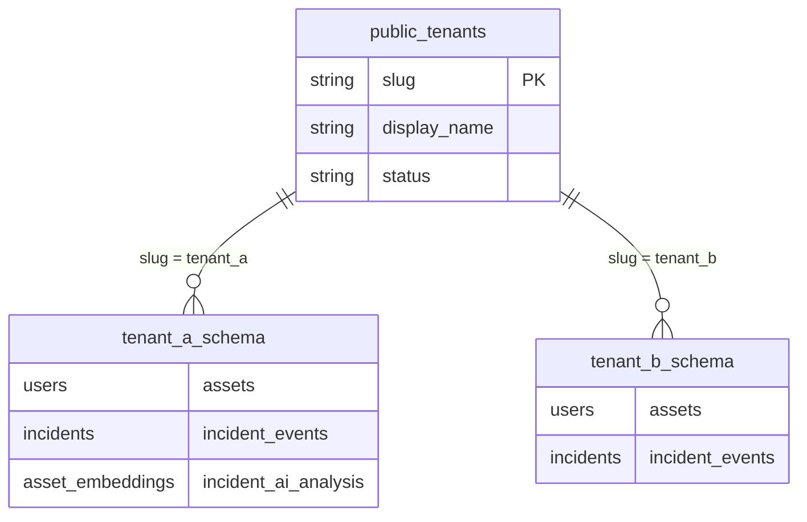

# Multi-Tenancy Architecture

Synap is a multi-tenant platform built for complete isolation between tenants at every layer. No tenant can see, affect, or interfere with another tenant's data, compute, or traffic.

---

## Isolation Model Overview

Synap uses a **7-layer isolation model**:

| Layer | Mechanism | Enforced By |
|---|---|---|
| 1. Network | Separate K8s namespace per tenant | Kubernetes NetworkPolicy |
| 2. Traffic | Subdomain-based routing | Istio IngressGateway + VirtualService |
| 3. AuthN | JWT with `tenant_id` claim | Istio RequestAuthentication (RS256 JWKS) |
| 4. AuthZ (mesh) | Namespace-scoped AuthorizationPolicy | Istio DENY policy |
| 5. AuthZ (RBAC) | Role + method + path Rego policy | OPA ext_authz |
| 6. Database | Schema-per-tenant (`search_path` per connection) | PostgreSQL |
| 7. Cache | Prefixed keys per tenant (`itsm:{slug}:*`) | Redis key convention |

---

## Layer 1 — Kubernetes Namespace Isolation

Each tenant runs in a dedicated namespace. Services, ConfigMaps, Secrets, and RBAC policies are fully scoped to that namespace. A bug, crash, or resource exhaustion in `tenant-a` cannot affect `tenant-b`.



**NetworkPolicy rule:** Each namespace allows ingress only from `istio-system` (sidecar-injected traffic). Cross-namespace pod-to-pod traffic is denied.

---

## Layer 2 — Subdomain-Based Traffic Routing

The Istio IngressGateway uses `Gateway` + `VirtualService` resources to match the `Host:` header and route to the correct namespace.



**Subdomain map:**

| Tenant | Subdomain (dev) | Namespace |
|---|---|---|
| GlobalTech | tenant-a.itsm.local | tenant-a |
| StartupCo | tenant-b.itsm.local | tenant-b |
| FinCorp | tenant-c.itsm.local | tenant-c |

API calls from the frontend use relative paths (`/api/v1/*`). Istio routes these based on the `Host:` header already present in the session.

---

## Layer 3 — JWT Authentication (Istio RequestAuthentication)

Every API request must carry a valid JWT in `Authorization: Bearer <token>`. Istio validates the signature via the JWKS endpoint on the tenant's own `user-service`.



**JWT Algorithm:** RS256 (asymmetric — private key signs, Istio validates with public key)  
**Issuer:** `itsm-user-service`  
**Validated claims:** `exp`, `iss`, `tenant_id`  
**Injected headers:** `X-Tenant-ID` (from `tenant_id` claim), `X-User-Role` (from `role` claim)

> Note: Phases 3–5 used HS256 (symmetric). Phase 6 migrates to RS256 to enable Istio JWKS validation.

---

## Layer 4 — Istio AuthorizationPolicy (Tenant Isolation)

Two AuthorizationPolicy resources enforce tenant isolation at the mesh level:

1. **Namespace-level DENY-all** — rejects any request that does not carry a valid JWT with a `tenant_id` matching the destination namespace.
2. **Specific ALLOW rules** — allow public endpoints (`/health`, `/jwks.json`, `/api/v1/auth/login`) without a token.

This means a JWT issued for `tenant_b` cannot be used to call a service in `tenant_a` — the DENY policy blocks it at the gateway before the request reaches any application code.

---

## Layer 5 — OPA RBAC (Role-Based Access Control)

OPA runs as a standalone deployment in the `opa` namespace and is called by Istio Envoy via ext_authz (gRPC). It receives the HTTP method, path, and `X-User-Role` header and applies Rego policy.

### Role Matrix

| Role | GET (read) | POST (create) | PUT (update) | DELETE |
|---|---|---|---|---|
| **admin** | ✅ | ✅ | ✅ | ✅ |
| **agent** | ✅ | ✅ | ✅ (own resources) | ❌ |
| **viewer** | ✅ | ❌ | ❌ | ❌ |



### Key Rego rules
- `admin`: full access to all methods on all paths
- `agent`: GET/POST/PUT on `/api/v1/assets/*` and `/api/v1/incidents/*`; no DELETE
- `viewer`: GET only on all `/api/v1/*` paths
- All roles: POST `/api/v1/auth/*` always allowed (no JWT required)

---

## Layer 6 — PostgreSQL Schema-per-Tenant

PostgreSQL runs externally with one database (`itsm`) containing isolated schemas per tenant.



**How `search_path` is set:**

1. Istio injects `X-Tenant-ID: tenant_a` into the request
2. The service reads this header in the request middleware
3. For each DB connection: `SET search_path = tenant_a, public`
4. All subsequent SQL queries in that connection are scoped to `tenant_a.*`
5. The connection is returned to the pool; `search_path` resets

> `search_path` is NEVER set in the DSN. It is ALWAYS set per-connection at request time.

---

## Layer 7 — Redis Cache Isolation

Redis is a shared in-cluster instance. Tenant isolation is enforced by key prefix convention:

```
itsm:{tenant_slug}:{resource}:{operation}:{hash}

Examples:
  itsm:tenant_a:incidents:list:abc123
  itsm:tenant_a:assets:list:def456
  itsm:tenant_b:users:u1000001
```

**Rules:**
- Services MUST always prefix keys with `itsm:{tenant_slug}:`
- `FLUSHDB` is NEVER used — it would destroy all tenants' data
- Key TTL: 300 seconds for list endpoints; 600 seconds for individual records

---

## Tenant Registry

The `public.tenants` table is the authoritative registry of all tenants. Services validate that a tenant slug from `X-Tenant-ID` exists in this table before setting `search_path`.

```sql
-- public.tenants
SELECT slug, display_name, status FROM public.tenants;

-- slug       | display_name | status
-- -----------+--------------+--------
-- tenant_a   | GlobalTech   | active
-- tenant_b   | StartupCo    | active
-- tenant_c   | FinCorp      | active
```

---

## Dev Tenant Seeds

| Tenant | Display Name | Users |
|---|---|---|
| tenant_a | GlobalTech | admin@globaltech.example, agent1@globaltech.example, viewer1@globaltech.example |
| tenant_b | StartupCo | admin@startupco.example, agent1@startupco.example |
| tenant_c | FinCorp | admin@fincorp.example, agent1@fincorp.example |

All seed users have password: `Password123!` (dev only).

---

## Migration from Phase 5 Single-Namespace Model

Phase 5 deployed everything into `itsm-dev` for rapid development. Phase 6 migrates to the target model:

| Phase 5 (current) | Phase 6+ (target) |
|---|---|
| Namespace: `itsm-dev` | Namespaces: `tenant-a`, `tenant-b`, `tenant-c` |
| No Istio mesh | Istio STRICT mTLS mesh |
| No JWT validation at gateway | RS256 JWKS validation in RequestAuthentication |
| No OPA | OPA ext_authz with Rego RBAC |
| Single Helm release | One Helm release per tenant |
| No subdomain routing | Subdomain VirtualService routing |
