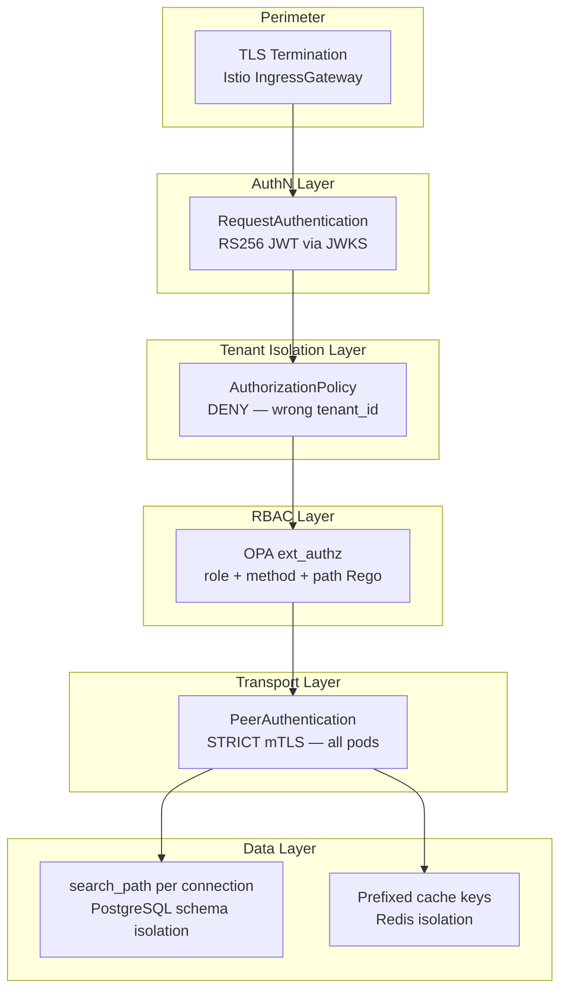
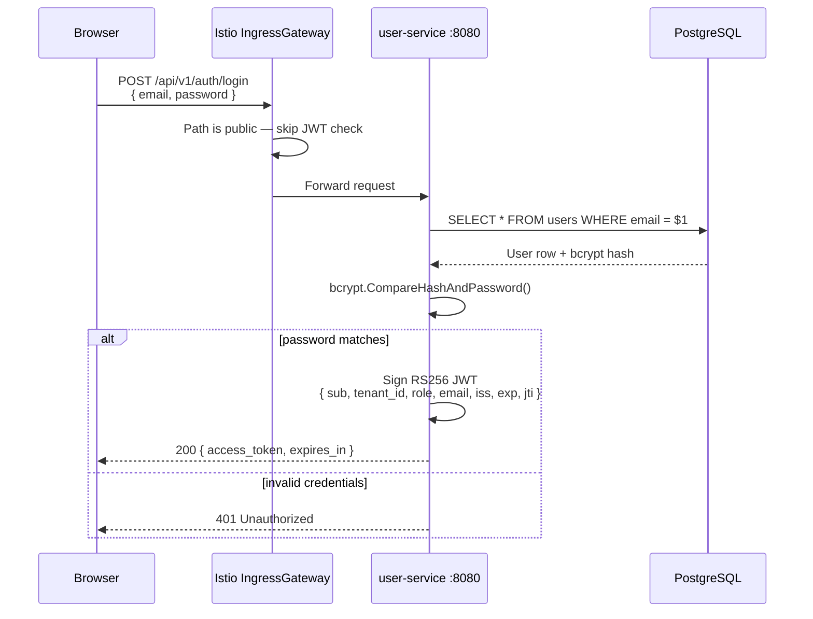
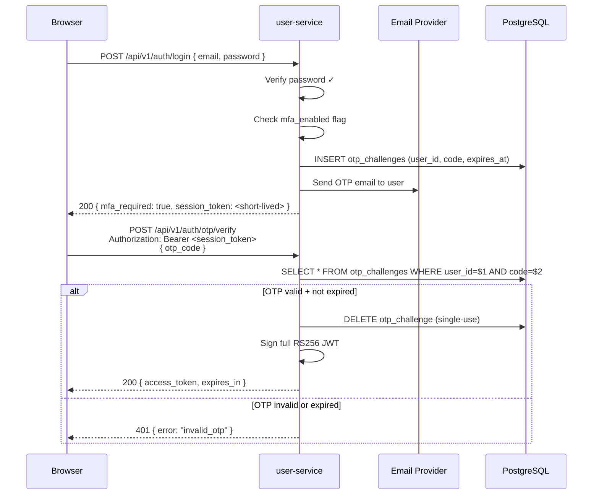
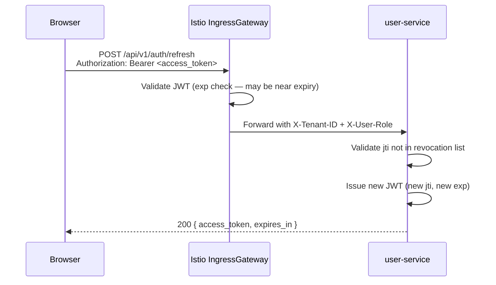
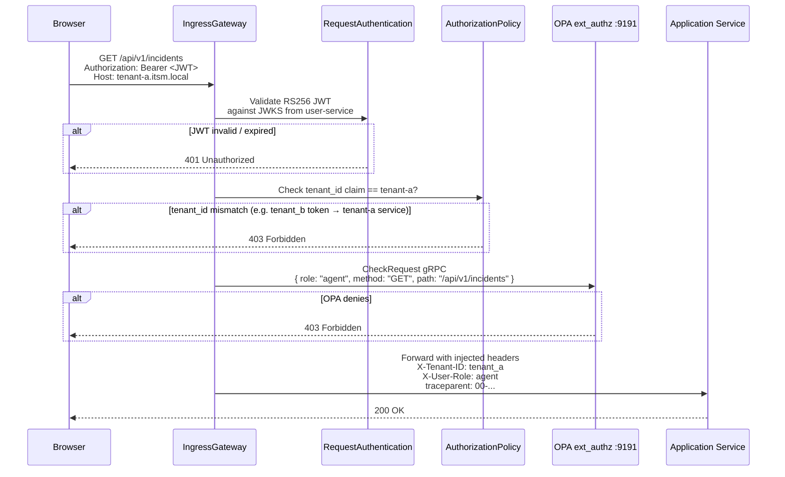

# Security Model

Synap implements a layered, zero-trust security architecture. No service trusts any incoming request without independent verification. This document describes every security control in the platform and how they chain together.

---

## Security Architecture Overview



---

## Authentication Flow

### 1. Standard Login (email + password)



### 2. MFA — Email OTP Flow (v0.4.0)

When MFA is enabled on a user account, login returns a partial token (`mfa_required: true`). The client must complete the OTP challenge before receiving a full access token.



### 3. Token Refresh



---

## Request Authorization Flow (Full Chain)

Every non-public API call passes through all four security layers in order:



---

## Istio Security Resources

### PeerAuthentication — STRICT mTLS

All pod-to-pod communication within the mesh uses mutual TLS. Istio automatically provisions and rotates certificates via Istiod.

```yaml
# Applied to each tenant namespace
apiVersion: security.istio.io/v1
kind: PeerAuthentication
metadata:
  name: default
  namespace: tenant-a
spec:
  mtls:
    mode: STRICT
```

No plaintext pod traffic is permitted. This protects against:
- Lateral movement if a container is compromised
- Traffic sniffing between services

### RequestAuthentication — RS256 JWKS Validation

```yaml
apiVersion: security.istio.io/v1
kind: RequestAuthentication
metadata:
  name: jwt-auth
  namespace: tenant-a
spec:
  jwtRules:
    - issuer: "itsm-user-service"
      jwksUri: "http://user-service.tenant-a.svc.cluster.local:8080/api/v1/.well-known/jwks.json"
      audiences: ["itsm-synap"]
      forwardOriginalToken: false
```

### AuthorizationPolicy — Tenant DENY

```yaml
# Deny all requests that do not carry a valid JWT with matching tenant_id
apiVersion: security.istio.io/v1
kind: AuthorizationPolicy
metadata:
  name: require-jwt
  namespace: tenant-a
spec:
  action: DENY
  rules:
    - from:
        - source:
            notRequestPrincipals: ["*"]
      to:
        - operation:
            notPaths: ["/health", "/api/v1/.well-known/jwks.json", "/api/v1/auth/login"]
```

### AuthorizationPolicy — OPA ext_authz (CUSTOM)

```yaml
apiVersion: security.istio.io/v1
kind: AuthorizationPolicy
metadata:
  name: opa-authz
  namespace: tenant-a
spec:
  action: CUSTOM
  provider:
    name: opa-ext-authz-grpc
  rules:
    - to:
        - operation:
            paths: ["/api/v1/*"]
```

---

## OPA Rego Policy

OPA evaluates role-based access using a simple allow matrix:

```rego
package itsm.authz

import future.keywords.if
import future.keywords.in

default allow = false

# Admin: full access
allow if {
    input.attributes.request.http.headers["x-user-role"] == "admin"
}

# Agent: read + write, no delete
allow if {
    input.attributes.request.http.headers["x-user-role"] == "agent"
    input.attributes.request.http.method in {"GET", "POST", "PUT"}
}

# Viewer: read-only
allow if {
    input.attributes.request.http.headers["x-user-role"] == "viewer"
    input.attributes.request.http.method == "GET"
}

# Public paths: always allow
allow if {
    input.attributes.request.http.path in {
        "/health",
        "/api/v1/.well-known/jwks.json",
        "/api/v1/auth/login",
        "/api/v1/auth/refresh",
    }
}
```

---

## JWT Key Management

| Phase | Algorithm | Key Storage | Validation |
|---|---|---|---|
| Phase 3–5 | HS256 (symmetric) | K8s Secret (`JWT_SECRET`) | user-service only |
| Phase 6+ | RS256 (asymmetric) | K8s Secret (private key), JWKS endpoint (public key) | Istio RequestAuthentication |

**RS256 key generation (Phase 6):**
```bash
openssl genrsa -out jwt-private.pem 2048
openssl rsa -in jwt-private.pem -pubout -out jwt-public.pem
kubectl create secret generic jwt-keypair \
  --from-file=private.pem=jwt-private.pem \
  --from-file=public.pem=jwt-public.pem \
  -n tenant-a
```

The private key is mounted read-only into `user-service`. The public key is served at `/api/v1/.well-known/jwks.json` in JWK Set format.

---

## Secret Management

| Secret | Type | Scope | Contents |
|---|---|---|---|
| `jwt-keypair` | K8s Secret | Per-namespace | RS256 private + public key PEM |
| `db-credentials` | K8s Secret | Per-namespace | `DATABASE_URL` |
| `redis-credentials` | K8s Secret | Per-namespace | `REDIS_URL` |
| `rabbitmq-credentials` | K8s Secret | Per-namespace | `RABBITMQ_URL` |

All secrets are namespace-scoped. No cross-namespace secret access is permitted.

> Phase 9 will introduce sealed secrets or external secrets operator for GitOps-safe secret management.

---

## Security Roles

| Role | Description | Typical User |
|---|---|---|
| `admin` | Full platform access; can manage users, assets, incidents | IT Manager |
| `agent` | Can create/update assets and incidents; cannot delete or manage users | IT Technician |
| `viewer` | Read-only access to all resources | End-user / Observer |

---

## Threat Model Summary

| Threat | Mitigation |
|---|---|
| Cross-tenant data access | AuthorizationPolicy checks `tenant_id`; schema-per-tenant in PG |
| JWT forgery | RS256 asymmetric signing; private key never leaves user-service |
| Privilege escalation | OPA role matrix enforced at gateway before reaching any service |
| Lateral movement | STRICT mTLS — all pod traffic encrypted + authenticated |
| Replay attack | `jti` (JWT ID) claim; short expiry (15 min access token) |
| Cache poisoning across tenants | Redis key prefix enforced; no unscoped keys permitted |
| Noisy neighbour / DoS | Resource limits + HPA (max=2) per service; rate limiting in Istio |
