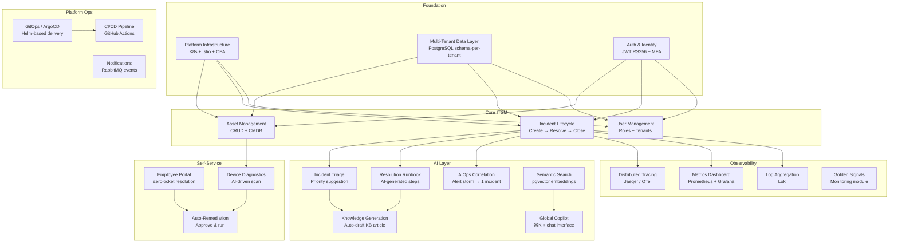

# Feature Map

This document maps every Synap feature to its product module, frontend sprint, backend phase, and current build status.

---

## Feature Map Diagram

---

## Feature Inventory by Module

### Authentication & Identity

| Feature | Sprint | Phase | Status |
|---|---|---|---|
| Email + password login | Sprint 1 | Phase 3 | ✅ Backend done / 🔲 UI pending |
| Email OTP MFA | Sprint 1 | Phase 6 (v0.4.0) | 🔲 Pending |
| JWT issue (RS256) | — | Phase 6 | 🔲 In Progress |
| JWKS endpoint | — | Phase 3 | ✅ Complete |
| Token refresh | Sprint 1 | Phase 3 | ✅ Backend done |
| Role-based access (RBAC via OPA) | — | Phase 6 | 🔲 In Progress |
| Tenant isolation (Istio AuthzPolicy) | — | Phase 6 | 🔲 In Progress |

### Asset Management

| Feature | Sprint | Phase | Status |
|---|---|---|---|
| Asset CRUD | Sprint 3 | Phase 4 | ✅ Backend done / 🔲 UI pending |
| Asset type filtering | Sprint 3 | Phase 4 | ✅ Backend done |
| Full-text search (pg_trgm) | Sprint 3 | Phase 4 | ✅ Backend done |
| Asset detail view | Sprint 3 | — | 🔲 UI pending |
| Asset → Incident link | Sprint 3 | Phase 4 | ✅ Backend done |
| Redis cache for asset list/get | — | Phase 4 | ✅ Complete |
| CMDB view | Sprint 8 | Phase 7 | 🔲 Pending |
| pgvector semantic search | Sprint 8 | Phase 7 | 🔲 Pending |

### Incident Management

| Feature | Sprint | Phase | Status |
|---|---|---|---|
| Incident CRUD | Sprint 4 | Phase 4 | ✅ Backend done / 🔲 UI pending |
| Status lifecycle (open→closed) | Sprint 4 | Phase 4 | ✅ Backend done |
| Priority management (P1–P4) | Sprint 4 | Phase 4 | ✅ Backend done |
| Incident event audit trail | Sprint 4 | Phase 4 | ✅ Backend done |
| RabbitMQ event publishing | — | Phase 4 | ✅ Complete |
| AI triage (priority suggestion) | Sprint 4 | Phase 7 | 🔲 Pending |
| AI resolution runbook | Sprint 4 | Phase 7 | 🔲 Pending |
| Similar incident suggestions | Sprint 4 | Phase 7 | 🔲 Pending |
| Auto-KB article generation | Sprint 9 | Phase 7 | 🔲 Pending |

### AIOps (Alert Correlation)

| Feature | Sprint | Phase | Status |
|---|---|---|---|
| Alert ingestion | Sprint 6 | Phase 7 | 🔲 Pending |
| Alert → incident correlation | Sprint 6 | Phase 7 | 🔲 Pending |
| Correlation visualization | Sprint 6 | — | 🔲 UI pending |
| Noise reduction metrics | Sprint 6 | Phase 7 | 🔲 Pending |

### End-User Self-Service Portal

| Feature | Sprint | Phase | Status |
|---|---|---|---|
| Issue description via chat | Sprint 7 | Phase 7 | 🔲 Pending |
| AI device diagnostics | Sprint 7 | Phase 7 | 🔲 Pending |
| Approve & run auto-remediation | Sprint 7 | Phase 7 | 🔲 Pending |
| Resolution confirmation | Sprint 7 | Phase 7 | 🔲 Pending |

### Observability

| Feature | Sprint | Phase | Status |
|---|---|---|---|
| OTel spans on all services | — | Phase 8 | 🔲 Pending |
| Prometheus custom metrics | Sprint 9 | Phase 8 | 🔲 Pending |
| Loki log aggregation | Sprint 9 | Phase 8 | 🔲 Pending |
| Jaeger distributed traces | Sprint 9 | Phase 8 | 🔲 Pending |
| Grafana dashboards | Sprint 9 | Phase 8 | 🔲 Pending |
| Golden signals monitoring module | Sprint 9 | Phase 8 | 🔲 Pending |

### Platform & Ops

| Feature | Sprint | Phase | Status |
|---|---|---|---|
| Helm chart per-tenant | — | Phase 5 | ✅ Complete |
| ArgoCD GitOps | — | Phase 9 | 🔲 Pending |
| CI lint (Go/Python/TS) | — | Phase 1 | ✅ Complete |
| CI Docker build | — | Phase 1 | ✅ Complete |
| Docker push on release tag | — | Phase 9 | 🔲 Pending |
| Per-service CHANGELOG | — | Phase 1 | ✅ Complete |
| Semantic versioning | — | Phase 1 | ✅ Complete |
| Notification service | Sprint 9 | Phase 8 | 🔲 Pending |

### Frontend (Synap UI)

| Feature | Sprint | Status |
|---|---|---|
| Vite + React 18 + TypeScript scaffold | Sprint 0 | ✅ Complete |
| OKLCH design token system | Sprint 0 | ✅ Complete |
| Primitive component library | Sprint 0 | ✅ Complete |
| Login + MFA screen | Sprint 1 | 🔲 Pending Phase 6 |
| App shell (sidebar + topbar) | Sprint 2 | 🔲 Not Started |
| Asset module | Sprint 3 | 🔲 Not Started |
| Incident module | Sprint 4 | 🔲 Not Started |
| Ops Dashboard | Sprint 5 | 🔲 Not Started |
| AIOps Event Console | Sprint 6 | 🔲 Not Started |
| End-User Portal | Sprint 7 | 🔲 Not Started |
| CMDB + Service Map + Cloud | Sprint 8 | 🔲 Not Started |
| Monitoring + KB + Analytics + Admin | Sprint 9 | 🔲 Not Started |
| Global Copilot + ⌘K | Sprint 10 | 🔲 Not Started |
| Real API wiring (TanStack Query) | Sprint 11 | 🔲 Not Started |

---

## Screen → Backend Service Mapping

| Screen | Primary Service | Secondary Services |
|---|---|---|
| Login / MFA | user-service | — |
| App Shell | user-service | — |
| Ops Dashboard | incident-service, asset-service | user-service |
| AIOps Event Console | incident-service | ai-service |
| Incidents | incident-service | asset-service, ai-service |
| End-User Portal | ai-service | incident-service |
| Assets | asset-service | — |
| CMDB | asset-service | ai-service |
| Service Map | asset-service | incident-service |
| Monitoring | — | observability stack |
| Knowledge Base | incident-service | ai-service |
| Analytics | incident-service, asset-service | — |
| Admin | user-service | — |
| Global Copilot | ai-service | all services |
