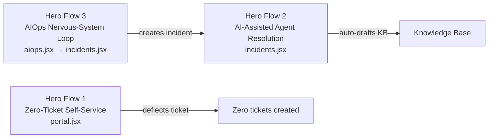
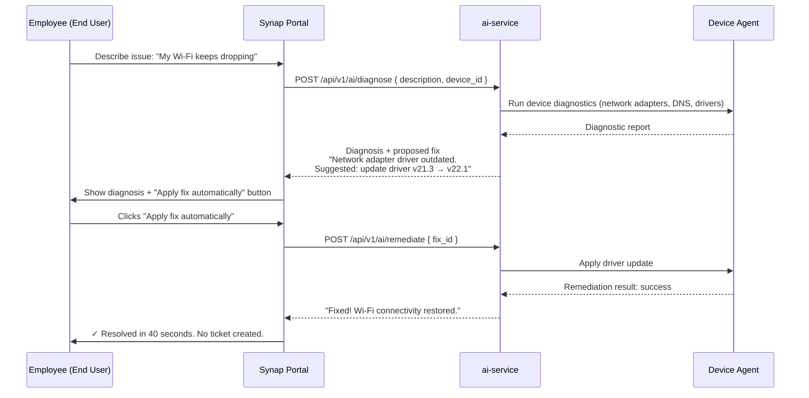
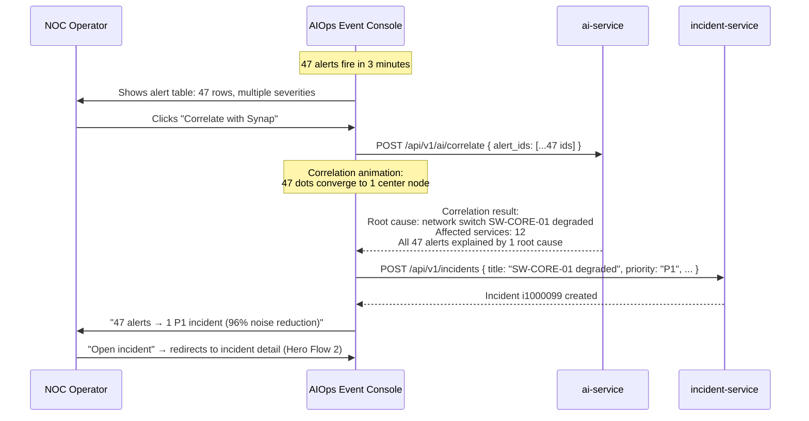

# Hero Flows

Synap is built around three end-to-end "wow" flows. These are the product's most important demonstrations of value. Every sprint must keep them working.

---

## Overview



---

## Hero Flow 1 — Zero-Ticket Self-Service

**Persona:** End User (employee, not IT staff)  
**Frontend:** `reference/portal.jsx` → Sprint 7  
**Backend:** ai-service (Phase 7)  
**Value proposition:** Deflect L1 support tickets entirely. Employee resolves own issue in ~40 seconds.

### Flow



### Success Criteria
- Issue resolved without an IT agent
- No incident ticket created in the system
- Resolution time < 60 seconds (demo target: ~40 seconds)
- Employee satisfaction: one-click experience

### Integration Seams (Sprint 7 → Sprint 11)
```typescript
// Sprint 7: faked latency
const result = await new Promise(resolve =>
  setTimeout(() => resolve(MOCK_DIAGNOSIS), 1800)
);
// TODO: real API — POST /api/v1/ai/diagnose
```

---

## Hero Flow 2 — AI-Assisted Agent Resolution

**Persona:** IT Agent / SRE  
**Frontend:** `reference/incidents.jsx` → Sprint 4  
**Backend:** incident-service (Phase 4) + ai-service (Phase 7)  
**Value proposition:** Reduce MTTR from hours to minutes. AI generates a runbook and agent approves + executes it inline.

### Flow

```mermaid
sequenceDiagram
    participant A as IT Agent
    participant I as Incident Detail Screen
    participant IS as incident-service
    participant AI as ai-service
    participant AS as asset-service

    A->>I: Open incident INC-0042<br/>"Production DB — 500ms latency spike"

    I->>IS: GET /api/v1/incidents/i1000042
    IS-->>I: Incident data + event trail

    I->>AS: GET /api/v1/assets/{related_asset_id}
    AS-->>I: Asset: db-prod-01, CPU 94%, Disk 87%

    I->>AI: POST /api/v1/ai/triage { incident_id }
    AI-->>I: Priority: P1 (Critical)<br/>Root cause: disk I/O saturation<br/>Confidence: 0.91

    I->>AI: POST /api/v1/ai/runbook { incident_id }
    AI-->>I: Resolution runbook:<br/>1. Kill long-running queries<br/>2. Clear temp tables<br/>3. Restart connection pool<br/>4. Monitor for 5 min

    A->>I: Reviews runbook + live telemetry chart
    A->>I: Clicks "Approve & Run"

    I->>IS: PUT /api/v1/incidents/i1000042 { status: "in_progress" }
    I->>AI: POST /api/v1/ai/execute { runbook_id }

    loop Each runbook step
        AI-->>I: Step N ✓ complete
    end

    AI-->>I: All steps complete — latency restored to 12ms
    A->>I: Marks incident resolved
    IS-->>I: Incident closed; incident_events appended

    I->>AI: POST /api/v1/ai/kb-draft { incident_id }
    AI-->>I: Draft KB article ready for review
```

### Key UI Moments
1. **AI triage badge** — P1 suggested priority shown inline on incident card
2. **Live telemetry charts** — CPU, disk, response time for the related asset (sourced from Prometheus via OTel)
3. **AI timeline** — chronological AI analysis events alongside human actions
4. **Numbered runbook stepper** — each step shows: queued → running (typing dots) → ✓ done
5. **Similar incidents panel** — top 3 semantically similar past incidents with resolution time

### Success Criteria
- MTTR target: < 15 minutes from incident open to resolved
- Runbook accuracy: AI-suggested steps result in resolution ≥ 80% of the time
- KB article auto-drafted for every resolved P1/P2 incident

---

## Hero Flow 3 — AIOps Nervous-System Loop

**Persona:** NOC Operator / SRE  
**Frontend:** `reference/aiops.jsx` → Sprint 6  
**Backend:** incident-service + ai-service (Phase 7)  
**Value proposition:** Turn a 47-alert storm into 1 actionable incident with root cause. 96% noise reduction.

### Flow



### Key UI Moments
1. **Alert storm table** — 47 rows with severity, service, source, time
2. **Correlation button** — "Correlate with Synap" with AI gradient styling
3. **Correlation animation** — scattered dots converge to center (0.9s cubic-bezier, 18ms stagger)
4. **Impact panel** — "12 services affected" topology mini-map
5. **Noise reduction badge** — "96% reduction" shown prominently
6. **Auto-created incident card** — slides in after correlation completes

### Success Criteria
- Correlation completes in < 3 seconds
- All related alerts are linked to the single created incident
- Root cause identified with ≥ 85% accuracy
- Operator takes ≤ 2 clicks to go from alert storm to incident detail

---

## Hero Flow Status by Sprint

| Hero Flow | Key Screens | Build Sprints | Backend Phases | Status |
|---|---|---|---|---|
| HF1 — Zero-Ticket Self-Service | Portal | Sprint 7 | Phase 7 | 🔲 Pending |
| HF2 — AI-Assisted Resolution | Incident Detail | Sprint 4 + Phase 7 | Phase 4 + 7 | 🔲 Partial (backend only) |
| HF3 — AIOps Correlation | AIOps Console | Sprint 6 | Phase 7 | 🔲 Pending |

> Hero Flow 2 has partial backend support (incident CRUD + events from Phase 4). The AI triage, runbook, and execution components require Phase 7.

---

## Integration with SDLC

Each hero flow follows the full SDLC gate before being marked complete:

```
Design prototype (reference/*.jsx)
  → UI development (Vite + React sprint)
    → Backend development + integration
      → Infra deployment (K8s + Istio)
        → E2E testing (all steps above work together)
          → Mark sprint + phase complete
            → Move to next hero flow
```

No hero flow is considered done until it has been tested end-to-end in the live K8s cluster with real JWT, real API calls, and real tenant data.
